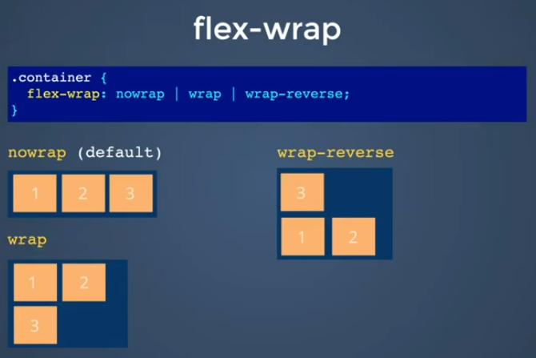
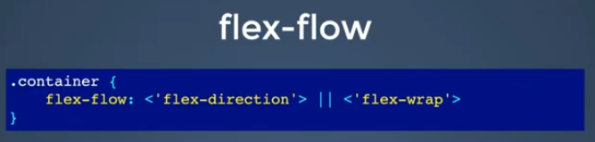

# Что такое flexbox

Flexbox - это технолония разметки страницы.  
Технология позволяет контролировать размер, порядок и выравнивание элементов по нескольким осям, распределять свободное место между элементами и др.

# Активация flexbox

1. Задать элементу свойство `display: flex`; 
1. После этого данный элемент превращается во флекс-контейнер и внутри него осуществляется гибкая раскладка.
1. Непосредственные потомки (1 уровня) этого элемента превращаются во флекс-элементы и начинают работать по флекс-правилам.

# Архитектура flexbox

Флексбокс - это контейнер, все элементы в котором располагаются одним из двух способов: по вертикали или по горизонтали.  
Горизонтальная ось является главной по умолчанию.

# Свойства flex-контейнера

Работа с направлением контента:
- flex-direction

Позиционирование рядов:
- flex-flow
- align-content

Позиционирование элементов:
- justify-content
- align-items

Другое:
- flex-wrap

# Свойства flex-элементов

Порядок элементов:
- order

Размер элементов:
- flex-grow / flex-shrink
- flex-basis
- flex

Позиционирование элементов:
- align-self

# Flex-direction (направление)

Свойство определяет направление расположения элементов.  
Синтаксис: `flex-direction`

__Значения:__
- `row` - горизонтально слева направо (по умолчанию)
- `row-reverse` - горизонтально справа налево
- `column` - вертикально от первого к последнему
- `column-reverse` - вертикально от последнего к первому

# Flex-wrap

Свойство задаёт поведение элементов в том случае, когда их слишком много и они не помещаются в ряд.  
Синтаксис: `flex-wrap`

__Значения:__

- `nowrap` - элементы будут "тиснуться" в одну линию, даже деформируюясь и ужимаясь. По умолчанию запрещен.
- `wrap` - элементы выстраиваются в ряды вдоль поперечной оси.
- `wrap-reverse` - элементы выстраиваются в ряды против поперечной оси: первый в конце поперечной оси, а последний в начале.

# Flex-flow

Данное свойство - комбинация свойств flex-direction и flex-wrap. По умолчанию этим свойствам присваиваются значения row и nowrap соответственно.

# Justify-content

Свойство определяет порядок горизонтального размещения элементов внутри контейнера в случае наличия свободного пространства.  
Синтаксис: `justify-content`

__Значения:__

- `flex-start` - расположение от начала главной оси  
Свойство по умолчанию
- `flex-end` - расположение в конце главной оси без изменения порядка элементов
- `center` - расположение по центру главной оси
- `space-between` - равномерное расстояние между элементами БЕЗ отступов по краям
- `space-around` - равномерное расстояние между элементами с отступом по краям в половину расстояния между элементами
- `space-evenly` - равномерное расстояние между элементами и краями контейнера

# Align-items

Свойство определяет порядок вертикального размещения элементов внутри контейнера в случае наличия свободного пространства.  
Свойство: `align-items`  
- Работает только с одним рядом элементов

__Значения:__

- `stretch` - расположение на всю высоту флекс-контейнера  
Свойство по умолчанию
- `center` - расположение по центру поперечной оси
- `flex-start` - расположение в начале поперечной оси
- `flex-end` - расположение в конце поперечной оси
- `baseline` - расположение по базовой линии текста в них (эта линия проходит по нижней части букв).  
Элементы выстроятся так, чтобы текст в них был как бы на одной строке.

# Align-content

Свойство определяет способ размещения рядов в случае разрешенного переноса.  
Синтаксис: `align-content`

__Значения:__

- `stretch` - растягивание рядов на всю высоту  
Значение по умолчанию
- `flex-start` - расположение рядов в начале поперечной оси
- `flex-end` - расположение рядов в конце поперечной оси
- `center` - расположение рядов по центру поперечной оси
- `space-between` - расположение рядов с одинаковым расстоянием между ними БЕЗ отступов сверху и снизу флекс-контейнера
- `space-around`- расположение рядов с одинаковым расстоянием между соседними строками с отступом сверху и снизу флекс-контейнера, равного половине расстояния между элементами

# Order

Свойство элемента определяет его порядок относительно других элементов в контейнере.  
Синтаксис: `order: порядковый номер`

# Flex-grow / flex-shrink

Свойство задает возможность роста/уменьшения конкретного элемента.   
Увеличение (синтаксис): `flex-grow: n`  
Уменьшение (синтаксис): `flex-shrink: n`  
n - это значение, определяющее кратность его увеличения / уменьшения отсносительно стандартного элемента. 

# Flex-basis

Свойство задает точное значение элементу.
- flex-basis сильнее свойств width и height этого элемента.

__Значения:__

- `auto` - размер берётся из width или height
- `10px` - точный размер

# Flex

Свойство, объединяющее в себе свойства `flex-grow`, `flex-shrink` и `flex-basis`.

# Align-self

Свойство выравнивает элемент по вертикали.

__Значения:__

`stretch` - элемент растягивается на всю высоту флекс-контейнера  
Свойство задано по умолчанию
`center` - элемент располагается по центру поперечной оси
`flex-start` - элемент располагается в начале поперечной оси
`flex-end` - элемент располагается в конце поперечной оси
`baseline` - элемент располагается по базовой линии текста в них